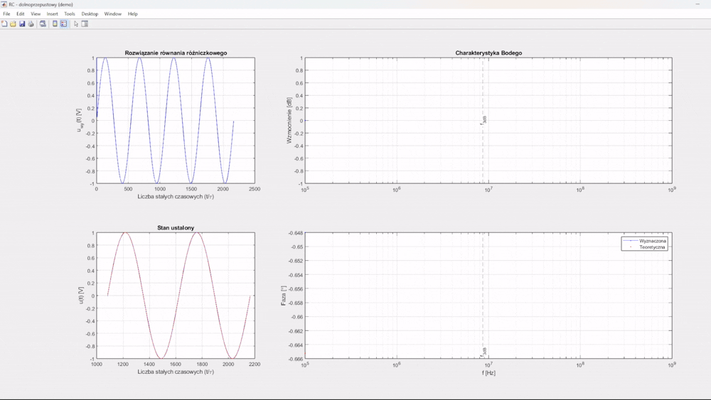
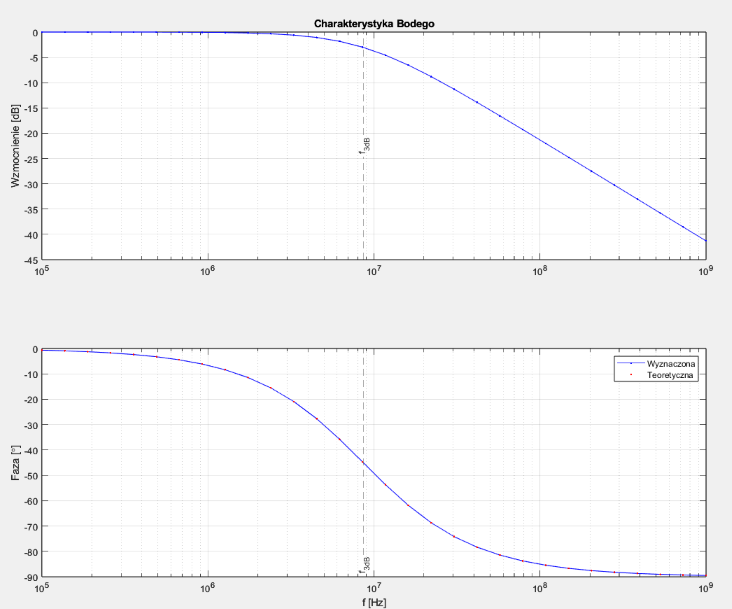

# RC-RL Frequency Response Analysis in MATLAB  

## Introduction  
The goal of this project was to obtain Bode plots for first-order circuits using differential equations solved with the Runge-Kutta method in MATLAB.  

## Method Overview  
A periodic input signal with a known frequency was applied to the circuit. Using the Runge-Kutta algorithm, the differential equations for RC and RL circuits were solved to determine the output waveforms.  

The gain and phase shift were determined by comparing the input waveform with the steady-state output waveform.  

To obtain the frequency response characteristics, this process was repeated for multiple frequencies within a predefined range.  

## Example simulation
Components values:

R = 3.3e3;      % [ohm]

C = 5.6e-12;    % [F]





## Simulation Settings  

```matlab
% Component values
R = 1e6;            % [ohm]
L = 1e3;            % [H]
C = 1e-9;           % [F]

% Frequency range
    % 0 Hz      fn = -1
    % 1 Hz      fn = 0
    % 1 MHz     fn = 6
fn_start = 0;       % Initial frequency order of magnitude (10^fn)
fn_stop = 3;        % Final frequency order of magnitude (10^fn)

% Simulation parameters
n = 30;             % Number of test frequencies
ampl = 1;           % Amplitude of the sinusoidal excitation voltage [V]
fi = 0;             % Phase shift of the sinusoidal excitation voltage [rad]
u_c0 = 0;           % Initial condition: Capacitor voltage [V]
i_l0 = 0;           % Initial condition: Inductor current [A]
tau_n = 20;         % Number of time constants (time base)
min_tau = 10;       % Minimum duration of the transient state (warning if shorter)
periods = 2;        % Number of steady-state periods
min_periods = 2*periods;  % Minimum number of excitation signal periods 
p_const = 10000;    % Resolution/step parameter (sampling frequency multiplier)
